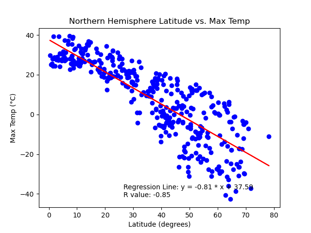
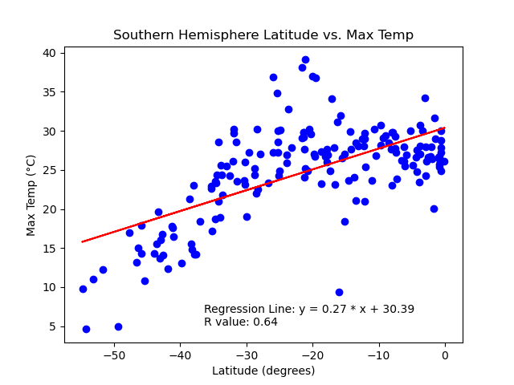
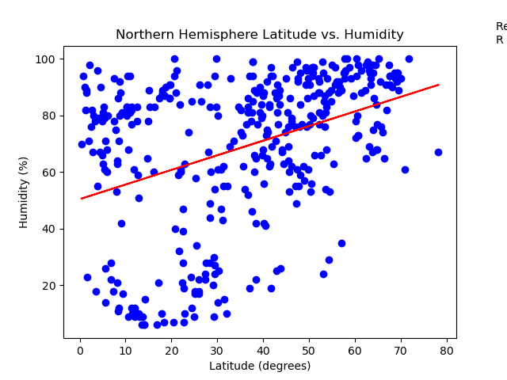
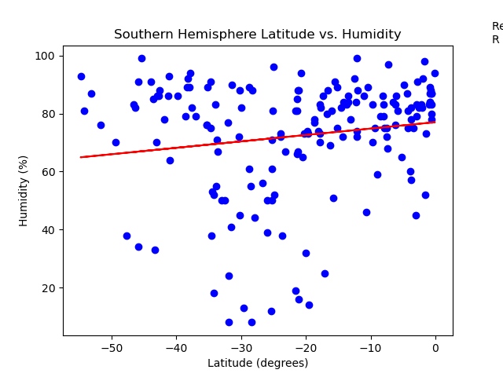
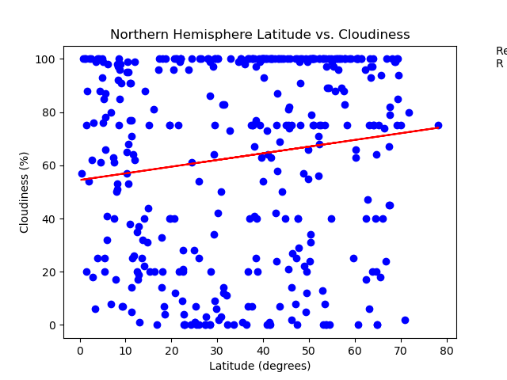
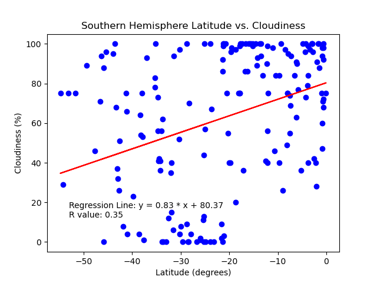
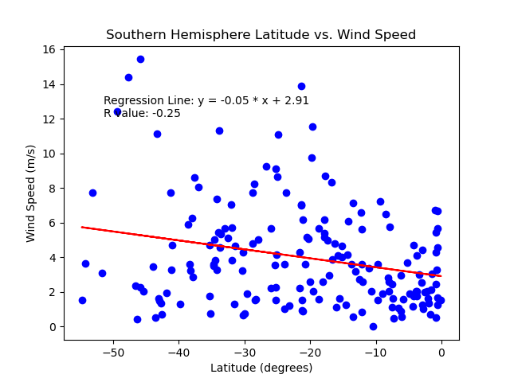

# Data-assignment-week6-python-api-challenge

## Weather Task

### Northern Hemisphere: Temperature (C) vs. Latitude

There is a strong negative linear relationship between the Northern Hemisphere Max Temperature (degrees celsius) and Latitude.

### Southern Hemisphere: Temperature (C) vs. Latitude

There is a moderate positive linear relationship between the Southern Hemisphere Max Temperature (degrees celsius) and Latitude.

### Northern Hemisphere: Humidity (%) vs. Latitude

There is a weak positive linear relationship between the Northern Hemisphere Humidity (percent) and Latitude. The relationship is not meaningful.

### Southern Hemisphere: Humidity (%) vs. Latitude

There is a very weak positive linear relationship between the Southern Hemisphere Humidity (percent) and Latitude. The relationship is not meaningful.

### Northern Hemisphere: Cloudiness (%) vs. Latitude

There is a very weak positive linear relationship between the Northern Hemisphere Cloudiness (percent) and Latitude. The relationship is not meaningful.

### Southern Hemisphere: Cloudiness (%) vs. Latitude

There is a very weak positive linear relationship between the Northern Hemisphere Cloudiness (percent) and Latitude. The relationship is not meaningful.

### Northern Hemisphere: Wind Speed (m/s) vs. Latitude

There is a very weak negative linear relationship between the Northern Hemisphere Wind Speed (metres per second) and Latitude. The relationship is not meaningful.

### Southern Hemisphere: Wind Speed (m/s) vs. Latitude

There is a very weak negative linear relationship between the Southern Hemisphere Wind Speed (metres per second) and Latitude. The relationship is not meaningful.

## Vacation Task

### Map Displaying Humidity Across the Globe

![Humidity In World Cities] (output_data/HumidityInWorldCities.PNG)

### Map Displaying Hotels within a 10km radius Ideal Weather

![Humidity In World Cities] (output_data/HotelsInIdealWeatherCities.PNG)

I created a list of cities with my ideal weather parameters being:

Between 21 to 35 degrees Celsius

Below 45% humidity.

This cut down the list of cities across the globe in the first data set to a much more managable list.

Of the cities within Australia, I would choose to visit the Ibis Styles Hotel in Broken Hill.

If I were to travel overseas, I would choose to visit Bredasdorp in South Africa and stay in the Victoria Hotel.

## References

University of Adelaide. (2024). 02-Ins_Geoapify_Places [Git directory]. Retrieved from https://git.bootcampcontent.com/University-of-Adelaide/UADEL-VIRT-DATA-PT-12-2023-U-LOLC/-/tree/main/06-Python-APIs/3/Activities/02-Ins_Geoapify_Places?ref_type=heads

University of Adelaide. (2024). 03-Stu_Geoapify_Drills [Git directory]. Retrieved from https://git.bootcampcontent.com/University-of-Adelaide/UADEL-VIRT-DATA-PT-12-2023-U-LOLC/-/tree/main/06-Python-APIs/3/Activities/03-Stu_Geoapify_Drills?ref_type=heads

University of Adelaide. (2024). 04-Ins_Nearest-Restaurants [Git directory]. Retrieved from https://git.bootcampcontent.com/University-of-Adelaide/UADEL-VIRT-DATA-PT-12-2023-U-LOLC/-/tree/main/06-Python-APIs/3/Activities/04-Ins_Nearest-Restaurants?ref_type=heads

University of Adelaide. (2024). 06-Evr_Geoviews_Maps [Git directory]. Retrieved from https://git.bootcampcontent.com/University-of-Adelaide/UADEL-VIRT-DATA-PT-12-2023-U-LOLC/-/tree/main/06-Python-APIs/3/Activities/06-Evr_Geoviews_Maps?ref_type=heads

Data-assignment-week6-python-api-challenge, Tutor Session with Sibusiso, personal communication (Zoom), February 17, 2024

OpenAI ChatGPT (Version 3.5) [Computer software]. (2022).